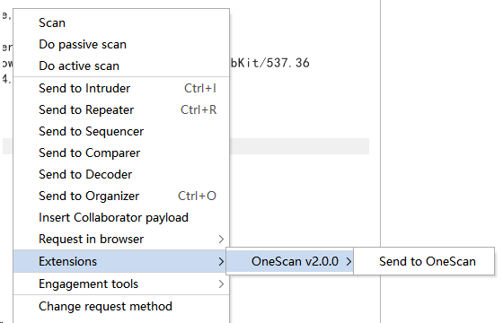
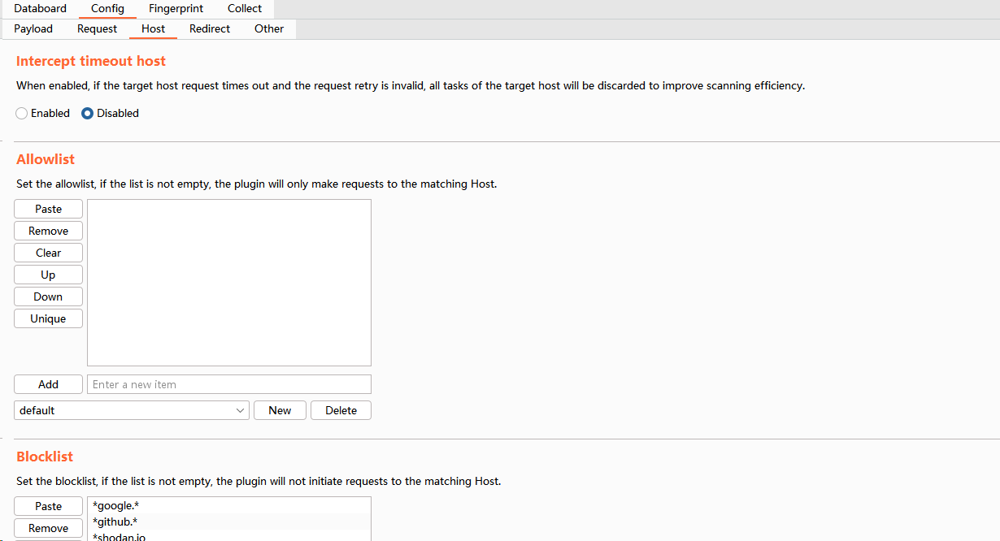

# OneScan

OneScan是递归目录扫描的BurpSuite插件。

## 插件介绍

OneScan插件的思路由One哥提供，我负责将One哥的思路进行编码变现。插件起初是为了发现站点的 `Swagger-API` 文档页面，例如有些站点将 `Swagger-API`
文档存放在当前API接口同路由下（或者更深层次目录），使用OneScan插件可以快速发现这类页面和接口

> 参与开发人员：
>
> - 主要开发: vaycore
> - 后续更新功能: Rural.Dog
> - 产品经理: 0ne_1

### 简单示例

例如配置Payload字典如下：

```text
/api-docs
/{{domain.name}}.zip
```

目标站点访问：`http://www.xxxxxx.com/a/b/c/xxx.min.js` ，插件会自动扫描如下的路径：

```text
http://www.xxxxxx.com/api-docs
http://www.xxxxxx.com/xxxxxx.zip
http://www.xxxxxx.com/a/api-docs
http://www.xxxxxx.com/a/xxxxxx.zip
http://www.xxxxxx.com/a/b/api-docs
http://www.xxxxxx.com/a/b/xxxxxx.zip
http://www.xxxxxx.com/a/b/c/api-docs
http://www.xxxxxx.com/a/b/c/xxxxxx.zip
```

## 插件安装

BurpSuite 安装流程如下：

```text
Extender -> Extensions -> Add -> Select File -> Next
```

流程结束后，打印如下信息表示插件安装完成（需要配置 [HaE](https://github.com/gh0stkey/HaE) 插件之后才会显示 **HaE** 插件的日志信息）：


插件配置文件存放路径如下：

```text
linux、macOS：
~/.config/OneScan/

windows：
C:\Users\<用户名>\.config\OneScan\
```

## 插件说明

### Databoard数据看板

插件数据看板说明如下


- `Listen Proxy Message` 开关被动扫描（默认禁用），代理的请求包都会经过OneScan（建议配置白名单后启用）
- `Exclude Header` 开关排除请求头（默认禁用），根据 `Request -> Exclude header` 里的配置，排除请求头中对应的值
- `Replace Header` 开关请求头替换（默认启用），使用 `Request -> Header` 中配置的请求头请求数据
- `DirScan` 开关递归扫描（默认启用），对目标进行递归扫描
- `Filter` 设置数据过滤规则

#### 过滤规则配置

点击主面板的`Filter`按钮，打开设置过滤规则对话框（插件`0.5.2`版本新增功能）


- `Select column` 选择要过滤的列
- `Add filter` 为选中列添加过滤条件
- `Clear` 清除选中列的所有过滤规则
- `Reset` 重置所有过滤规则
- `Cancel` 取消本次的所有变更
- `OK` 使配置的规则生效

### 主动扫描

可以从BurpSuite其它位置发送到OneScan主动扫描



### 辅助面板

提取请求和响应包中**JSON**格式的字段，插件`1.0.0`版本新增`Fingerprint`指纹信息展示


### 动态变量

目前支持的动态变量如下：

```text
{{host}} - 原请求头中的Host
{{domain}} - 原请求头中的Host（不包含端口号）
{{domain.main}} - 主域名（如：`www.google.com` => `google.com`；注意：如果domain是IP地址，那么该值也是IP地址）
{{domain.name}} - 主域名的名称（如：`www.google.com` => `google`；注意：如果domain是IP地址，那么该值也是IP地址）
{{protocol}} - 原请求头中的协议（http、https）
{{timestamp}} - Unix时间戳（单位：秒）
{{random.ip}} - 随机IPv4值
{{random.local-ip}} - 随机内网IPv4值
{{random.ua}} - 随机UserAgent值，随机源可配置
```

### Config配置

#### Payload（字典、Payload处理）

Payload配置界面如下


- `Payload` 配置递归扫描的字典
- `Payload Processing` 配置请求过程中对数据包的处理（例如：URL添加前缀、后缀，Body正则匹配和替换）

#### Request（请求相关配置）

Request配置界面如下


- `QPS` QPS限制，限制每秒请求的数量，最大值 `9999`
- `Include method` 配置请求方法白名单
- `Exclude suffix` 排除指定后缀的数据包
- `Header` 递归扫描过程的请求头配置，可配置变量
- `Exclude header` 请求时排除请求头中对应的值
- `UserAgent` 这里配置的是 `{{random.ua}}` 变量列表里的值

#### Host（主要是黑、白名单配置）

Host配置界面如下



- `Host Whitelist` 配置白名单列表，如果该列表不为空，插件则只能请求该列表中的Host
- `Host Blacklist` 配置黑名单列表，插件不对该列表配置的Host进行请求

#### Other（其它配置）

Other配置界面如下


- `Web name collect` Web目录名收集（例如：`http://xxx.com/wapi/xxx.html` 会将该 url 中的 `wapi` 写入到指定的文件中）
- `Json field collect` Json字段收集（收集json格式响应包中的所有key值，保存到指定目录）
- `Wordlist Directory` 插件`1.0.0`版本新增字典管理，此目录下包含所有字典文件的配置
- `HaE` 配置与 [HaE](https://github.com/gh0stkey/HaE) 插件联动，实现主面板数据高亮
- `Clear Temp` 清除指纹识别缓存（用于加快指纹识别的速度）

### Fingerprint指纹

插件`1.0.0`版本新增`Fingerprint`指纹模块，指纹管理界面如下


- `Reload` 重新加载配置文件中的指纹信息
- `Search` 搜索指纹库中的指纹信息
- `Test` 用于测试指纹规则

指纹信息全程使用UI添加，不需要编写正则匹配规则（也可以使用正则匹配），UI界面如下：


#### 指纹信息说明

- `Name` 指纹名称（产品名）
- `Company` 产品公司（默认：Other）
- `Lang` 编程语言
- `SoftHard` 软硬件（0=其它；1=硬件；2=软件）
- `Frame` 产品使用的开发框架
- `ParentCategory` 父类别（默认：Other）
- `Category` 类别（默认：Other）
- `Rules` 指纹匹配规则

#### 指纹规则说明

包含六种数据源

- `header` Header
- `server` Header 中的 Server 值
- `body` Body 数据
- `title` Html 标题
- `bodyMd5` Body 数据 MD5 值
- `banner` 其它协议的 Banner 信息（HTTP协议无法匹配该值）

共有十种匹配方法

- `equals` 匹配相等
- `notEquals` 匹配不相等
- `iEquals` 匹配相等（忽略大小写）
- `iNotEquals` 匹配不相等（忽略大小写）
- `contains` 包含
- `notContains` 不包含
- `iContains` 包含（忽略大小写）
- `iNotContains` 不包含（忽略大小写）
- `regex` 正则匹配
- `notRegex` 正则不匹配

## 插件演示

将如下数据包主动发送到OneScan：

```text
POST /mcp/pc/pcsearch HTTP/1.1
Host: ug.baidu.com
Content-Length: 56
User-Agent: Mozilla/5.0 (Windows NT 10.0; Win64; x64) AppleWebKit/537.36 (KHTML, like Gecko) Chrome/108.0.0.0 Safari/537.36
Content-Type: application/json
Accept: */*
Origin: https://www.baidu.com
Accept-Encoding: gzip, deflate
Accept-Language: zh-CN,zh;q=0.9
Connection: close

{"invoke_info":{"pos_1":[{}],"pos_2":[{}],"pos_3":[{}]}}
```

面板展示如下：


## END

- 代码写的很乱，还请师傅们见谅
- 欢迎各位师傅提交 `Issue` 和 `Pull requests`，一起完善项目
